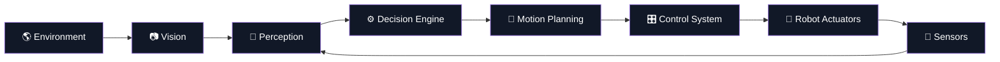

## 🤖 01 — TEAM // DURNIBAR

<p align="center">
  
</p>

<h1 align="center">TEAM DURNIBAR</h1>

<p align="center">
  <strong>Engineering the Future of Autonomous Robotics.</strong><br>
  <sub>Bangladesh 🇧🇩 · WRO Future Engineers 2026 · Autonomous Systems · AI · Robotics</sub>
</p>

<p align="center">
  
  
  
  
</p>

<p align="center">
  <em>Three engineers. One autonomous machine. One mission.</em>
</p>

---

### `> SYSTEM.INIT()`

**Team Durnibar** is a collegiate robotics team from Bangladesh competing in the **Future Engineers** category at the **World Robot Olympiad (WRO) 2026**.

We combine **mechanical engineering, embedded systems, computer vision, artificial intelligence, electronics, and autonomous control** to design and build a robot capable of operating intelligently in dynamic environments.

```text
┌──────────────────────────────────────────────────────────────┐
│                    DURNIBAR // CORE TEAM                     │
├──────────────────────────────────────────────────────────────┤
│                                                              │
│   CAD ──────► HARDWARE ──────► CONTROL ──────► VISION      │
│     │              │                │               │        │
│     └──────────────┴────────────────┴───────────────┘        │
│                            │                                 │
│                            ▼                                 │
│                    AUTONOMOUS ROBOT                          │
│                                                              │
└──────────────────────────────────────────────────────────────┘
```

---

## `01 // TEAM MATRIX`

<table align="center">
<tr>

<td align="center" width="33%">


### **AZMAIN SHAK RUBAYED**

**`TEAM LEAD`**

`CAD & VISION SYSTEMS`

Fusion 360 · ROS 2 · OpenCV · Python

<br>

<a href="mailto:rubayed_41220200226@nub.ac.bd">
  
</a>

</td>

<td align="center" width="33%">


### **RIFAT AHMMED**

**`CONTROL ENGINEER`**

`EMBEDDED SOFTWARE & CONTROL`

C · C++ · Microcontrollers · Motor Control

Independent University, Bangladesh

<br>

<a href="mailto:ra7260352@email.com">
  
</a>

</td>

<td align="center" width="33%">


### **MAHFUJ ROHOMAN**

**`HARDWARE ENGINEER`**

`ELECTRONICS & SYSTEM INTEGRATION`

Circuit Design · Sensors · Electronics · Hardware

Independent University, Bangladesh

<br>

<a href="mailto:member3@email.com">
  
</a>

</td>

</tr>
</table>

---

## `02 // ENGINEERING STACK`

<p align="center">


</p>

<p align="center">


</p>

---

## `03 // ARCHITECTURE`



---

## `04 // MISSION CONTROL`

<details>
<summary><strong>▸ OUR OBJECTIVE</strong></summary>

<br>

Design and engineer a highly capable autonomous robotic platform for **WRO Future Engineers 2026**.

Our focus is not simply building a robot that moves.

We are building a system that can:

* Perceive its environment
* Interpret sensor data
* Make autonomous decisions
* Plan movement
* Control its actuators
* Adapt to changing conditions
* Execute reliably under competition constraints

</details>

<details>
<summary><strong>▸ ENGINEERING PHILOSOPHY</strong></summary>

<br>

> **Design → Simulate → Build → Test → Measure → Iterate**

Every subsystem is treated as an engineering problem.

Mechanical design, electronics, firmware, perception, control, and autonomous behavior are developed as interconnected systems rather than isolated components.

</details>

<details>
<summary><strong>▸ WHY DURNIBAR?</strong></summary>

<br>

**Durnibar** represents determination, resilience, and forward movement.

We are building from Bangladesh with the ambition to compete at a global level.

</details>

---

## `05 // TEAM STATUS`

```text
SYSTEM STATUS
────────────────────────────────────────────

TEAM              ████████████████████  ONLINE
MECHANICAL         ███████████████████░  ACTIVE
ELECTRONICS        ██████████████████░░  ACTIVE
CONTROL            █████████████████░░░  ACTIVE
COMPUTER VISION    ████████████████░░░░  DEVELOPING
AUTONOMY           ██████████████░░░░░░  DEVELOPING

MISSION            ████████████████████  WRO 2026
```

---

## `06 // BUILD LOG`

We document the complete engineering journey inside this repository:

`/mechanical` → CAD & mechanical systems

`/electronics` → Schematics, PCBs & wiring

`/firmware` → Embedded control software

`/software` → ROS 2, perception & autonomy

`/simulation` → Testing & virtual validation

`/docs` → Engineering documentation

---

<p align="center">

### **BUILT IN BANGLADESH 🇧🇩**

### **ENGINEERED FOR THE WORLD 🌎**

<br>

<sub>
Team Durnibar · WRO Future Engineers 2026
</sub>

<br><br>


</p>
